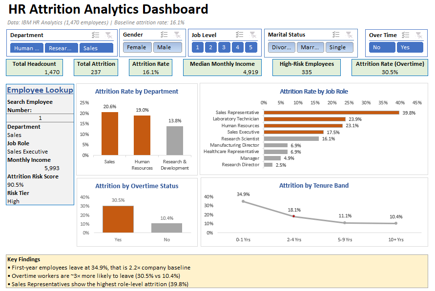
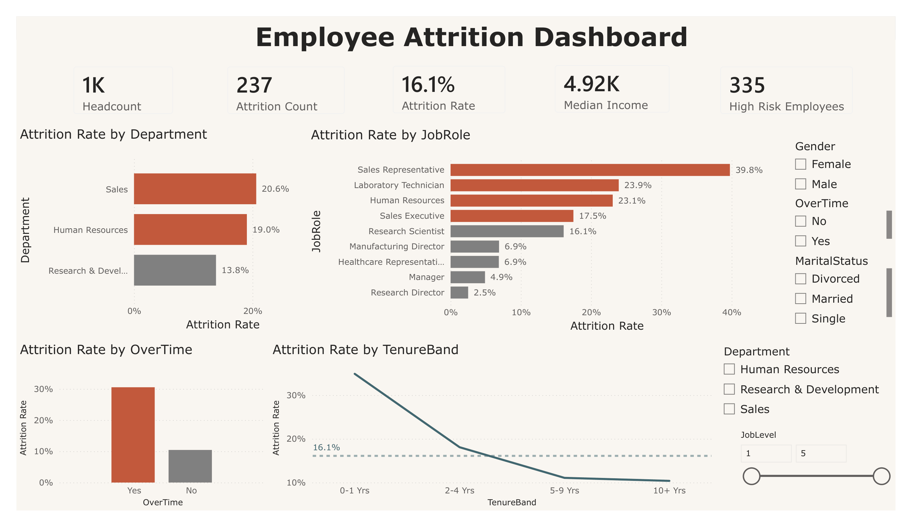

# HR Attrition Analytics — People Analytics Dashboard & Predictive Model

Analysis of employee turnover across 1,470 employees, delivered as an **Advanced Excel dashboard**, a **Power BI report**, and a **logistic regression risk model** — ending in four costed, actionable HR interventions.

**Stack:** Python (pandas, scikit-learn, statsmodels) · Advanced Excel (PivotTables, Slicers, XLOOKUP, conditional formatting) · Power BI (DAX)

---

## The headline

Attrition sits at **16.1%** overall — but it is not evenly spread. It concentrates in segments the organisation can actually control:

| Risk segment | Attrition rate | vs company baseline |
|---|---|---|
| First-year employees | **34.9%** | 2.2× |
| Employees working overtime | **30.5%** | 1.9× |
| Sales Representatives | **39.8%** | 2.5× |
| Entry-level (Job Level 1) | **26.3%** | 1.6× |
| No stock options granted | **24.4%** | 1.5× |

Every one of these is a **workload, onboarding, compensation or career-pathway decision** — not a fixed employee characteristic. That is what makes the problem solvable.

A separate salary equity audit found **no evidence of gender-based pay inequity** once job level is controlled for (gaps ≤2.5%, non-directional).

---

## Dashboards

### Advanced Excel


Built with Excel Tables and structured references, PivotTables and PivotCharts, five Slicers wired to every pivot via Report Connections, an XLOOKUP employee lookup panel, COUNTIFS-based conditional rate KPIs, and conditional formatting to flag segments above the company baseline.

### Power BI


Rebuilt in Power BI with DAX measures (`CALCULATE`, `DIVIDE`, `COUNTROWS`), automatic cross-filtering between visuals, and a custom sort column so tenure bands order logically rather than alphabetically.

---  

## What the model added

A univariate view alone would have been misleading. Two examples where the multivariate model changed the conclusion:

**Time since last promotion.** Raw comparison suggested leavers had *fewer* years since promotion (1.9 vs 2.2) — the opposite of intuition. This was **confounding**: leavers skew junior and simply haven't accumulated time. After controlling for age and tenure, the sign reverses and it becomes a significant risk factor (OR 1.74–1.86, p < 0.001).

**Percentage salary increase.** Widely assumed to drive retention — but stayers and leavers were effectively identical (15.2% vs 15.1%). **Absolute pay level matters; increment size does not.** This changed the compensation recommendation from "raise annual increments" to "benchmark Level 1 base pay and extend equity participation."

### Model performance

| Metric | Value |
|---|---|
| ROC-AUC | 0.819 |
| Recall (leavers) | 0.678 |
| Precision (leavers) | 0.421 |

**Why not accuracy?** The target is imbalanced (16.1% leavers). A naive "everyone stays" model scores 84% accuracy while detecting *zero* leavers. This model trades a little accuracy for catching roughly two-thirds of departures in advance — which is the outcome HR actually needs. Lower precision is an accepted trade-off: a false alarm costs a supportive conversation; a missed departure costs a replacement hire.

---

## Recommendations

Full detail with business impact and success metrics in **[insights.md](insights.md)**.

1. **Structured first-year onboarding** — peer mentor from day one, formal 30/60/90/180-day check-ins, career pathway clarified within 90 days. *Target: 34.9% → below 25% in 12 months.*
2. **Overtime and workload governance** — audit overtime by team to separate chronic understaffing from peak-period load; treat sustained overtime as a headcount gap. *Target: 28.3% → below 20% of workforce.*
3. **Sales Representative role review** — compensation structure and quota attainability review, plus a visible progression path to Sales Executive. *Target: 39.8% → below 28%.*
4. **Compensation and equity participation** — extend stock option eligibility to Levels 1–2, benchmark Level 1 base pay. *Target: equity participation 57% → 75%.*

---

## Ethics

Gender, marital status and age were included in the diagnostic model to observe their relationships — marital status did emerge as significant (OR ~2.5). **No recommendation in this project is based on a protected characteristic.** Targeting employees differentially on those grounds would be discriminatory and, in most jurisdictions, unlawful; any operationally deployed risk model must have these fields removed.

Individual risk scores are designed to trigger **supportive intervention** — a career conversation, workload review, development opportunity — never to withhold promotion or justify pre-emptive termination.

All findings are observational. Correlation is not causation: overtime is strongly associated with attrition, but this analysis cannot prove that reducing overtime *causes* retention to improve. Interventions should be piloted and measured before/after.

---

## Repository structure

```
hr-attrition-analytics/
├── data/
│   ├── raw/                    # Original Kaggle dataset (not tracked)
│   └── processed/              # Cleaned + model-scored datasets
├── notebooks/
│   └── 01_cleaning_eda.ipynb   # Cleaning, EDA, analysis, logistic regression
├── dashboards/
│   ├── HR_Attrition_Dashboard.xlsx
│   └── HR_Attrition_Dashboard.pbix
├── outputs/
│   ├── dashboard_excel.png
│   ├── dashboard_powerbi.png
│   └── logit_model.pkl
├── insights.md                 # Full business writeup & recommendations
└── README.md
```

---

## Method

**Cleaning.** Dropped three constant columns (`EmployeeCount`, `Over18`, `StandardHours`) carrying zero information. Verified no missing values, no duplicate rows, unique employee IDs. Mapped ordinal 1–4 satisfaction scales to readable labels for reporting while retaining numeric versions for modelling. Banded tenure, age, income and commute distance for segment reporting.

**Diagnostic analysis.** Attrition rates computed per segment and indexed against the 16.1% baseline, so every finding reads as a multiple of the norm. Headcount reported alongside every rate to avoid over-reading small samples — a discipline that flagged the Sales Representative finding (n=83) as directionally clear but numerically less stable.

**Modelling.** Logistic regression with `class_weight='balanced'` on a stratified 75/25 split. Numeric features standardised so odds ratios are comparable across predictors. Statistical significance verified with statsmodels (p-values, 18 significant predictors at p < 0.05).

---

## Reproducing this analysis

```bash
git clone https://github.com/sryczu6-create/hr-attrition-analytics.git
cd hr-attrition-analytics
pip install pandas numpy scikit-learn statsmodels matplotlib seaborn jupyter
```

Download the dataset from [Kaggle — IBM HR Analytics Employee Attrition](https://www.kaggle.com/datasets/pavansubhasht/ibm-hr-analytics-attrition-dataset) and place it in `data/raw/`, then run `notebooks/01_cleaning_eda.ipynb`.

---

## Known limitations

The dataset is **synthetic** — unrealistically clean compared with real HRIS extracts. It contains **no date fields**, so no trend, seasonality or cohort-over-time analysis is possible. `PerformanceRating` contains only values 3 and 4 (rating inflation), making performance useless as a risk signal here. Risk scores are **in-sample** and therefore optimistic; production scoring should be out-of-fold. Age, tenure, income and job level are strongly intercorrelated, so their individual odds ratios must be read jointly rather than independently.

---

## Author

**Sry yulianti Lobo** — MSc Mathematics · Background in statistical modelling and time-series forecasting (ARIMAX, LSTM)

[LinkedIn](www.linkedin.com/in/sry-yulianti-lobo-052915118) · [Portfolio & Other projects](https://shelled-postbox-ca4.notion.site/Sry-Yulianti-Lobo-s-Portfolio-0f56e8d30501833283c581e4eb05bba7?source=copy_link))
